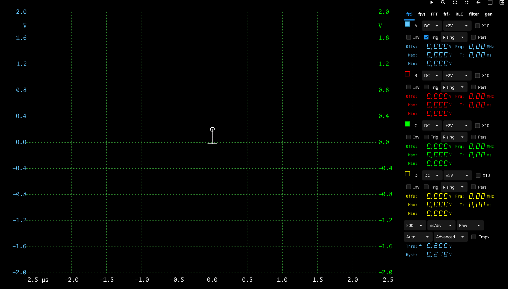
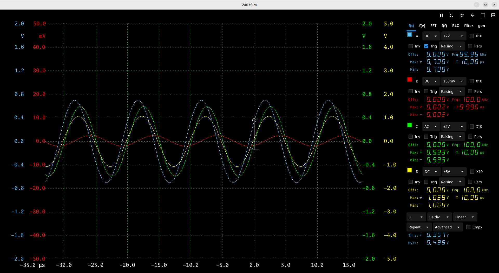
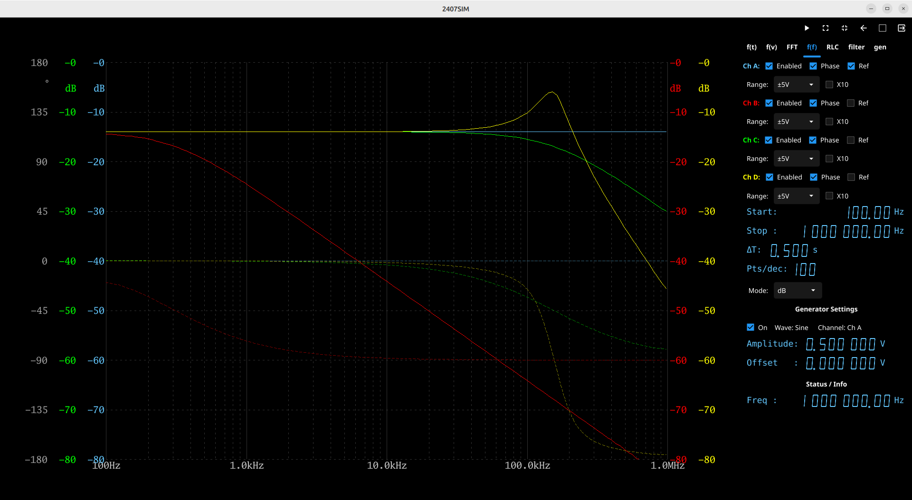
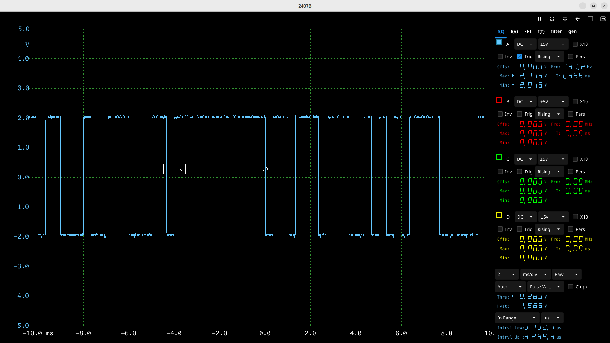

# fynescope

<p align="center">
  
</p>

`fynescope` is a prototype graphical user interface and control Linux application for PicoScope 2000 Series PC Oscilloscopes, written in Go and based on the Fyne widget toolkit and the PicoScope 2000 series SDK.

## Key Features & Navigation

Once the application is running, you can navigate between different visualization and control modes using the main tabs:

- **f(t)**: The standard time-domain oscilloscope view. Use the control panel on the right to adjust the timebase, signal display interpolation, trigger settings, and channel properties (voltage range, coupling, offset, and persistence). Toggle the **Pers** checkbox to overlay successive signal traces and track history over time. Clicking the magnifier icon on the top toolbar opens the **Time Zoom** window, which acts as a secondary wide-scale overview of the capture buffer while the main window becomes a movable, magnified viewport.
- **FFT**: The Fast Fourier Transform (FFT) view for frequency spectrum analysis. Toggle the **Pers** checkbox to enable persistent frequency magnitude tracking over time.
- **f(f)**: The frequency response analysis tab. Use this to perform automated frequency sweeps and generate Bode plots. The amplitude response is automatically plotted for all enabled channels, while phase plotting can be toggled individually. Capable of evaluating sub-1Hz frequencies (down to 0.01 Hz) and seamlessly integrating with external SCPI-compatible signal generators. *Note: Sweeping at very low frequencies is slow because the analysis relies on capturing sufficiently long time windows for FFT processing.*
<p align="center">
  
</p>

- **f(v)**: The X-Y plotting mode, useful for viewing Lissajous figures or phase relationships between channels.
- **Gen / ExtGen**: Control panels for configuring the PicoScope's built-in arbitrary waveform generator or a connected external SCPI signal generator.
- **Filters**: Built-in tabs for simple **RLC** filters (**simulator mode only**) and digital **filters** (FIR/IIR).

Additionally, the application features a **Simulator Mode**, allowing you to explore the interface without physical hardware using the built-in software simulator.
## Getting Started

### Prerequisites

- Ubuntu 24.04 or later. Other distros may require additional setup.
- Fyne 2.6.1 or later. Check at go.mod.
- Go 1.27 or later. Check at go.mod.
- Standard C compiler and dependencies for compiling `fyne.io/fyne/v2` and CGo bindings.

To use **real hardware**, the PicoScope driver libraries are also required:

- `libps2000a` (PicoScope 2000a Series driver) — available from the [Pico Technology downloads page](https://www.picotech.com/downloads/linux).

If you only want to explore the UI in **simulator mode**, no PicoScope drivers are needed. Use the `noscope` build tag (see [Building](#building) below).

### Building

Fyne dependency for Linux:

```bash
sudo apt-get update && sudo apt-get install -y libxrandr-dev libxcursor-dev libxinerama-dev libxi-dev libgl1-mesa-dev xorg-dev
```

Usb dependency for Linux (required for PicoScope hardware and external SCPI generator support):

```bash
sudo apt install libusb-1.0-0-dev
```

Get go dependencies:

```bash
go mod tidy
```

The application can be compiled with different features enabled via build tags:

- `noscope`: Build without the PicoScope C driver libraries (simulator mode only).
- `scpi`: Include the external SCPI signal generator module (requires `libusb-1.0-0-dev`).
- `web`: Include the read-only web server for sharing the GUI over the network via MJPEG streaming.

**Build Examples:**

To build the application purely for the simulator without requiring the PicoScope C driver libraries, and without external SCPI generator support:

```bash
go build -tags=noscope -o fynescope .
```

If you want to build the application with installed libps2000a driver and external SCPI generator support: 

```bash
go build -tags=scpi -o fynescope .
```

If you want to build with simulator and web server support:

```bash
go build -tags="noscope,web" -o fynescope .
```

If you want to build the application with installed libps2000a driver but without the SCPI/USB dependency: 

```bash
go build -o fynescope .
```

To embed the version, build date, and git commit hash, you can use `ldflags`. For example, using the short git commit hash as the version:

```bash
go build -ldflags="-X main.GitUUID=$(git rev-parse --short HEAD) -X main.BuildDate=$(date +%Y-%m-%d)" .
```


### Usage

Run the application directly. It will attempt to detect connected PicoScope devices and prompt you to select one.

```bash
./fynescope
```

To run the application strictly in simulator mode (without connected hardware):

```bash
./fynescope -sim
```

For more options, including displaying version, build date, and license information, run:

```bash
./fynescope -help
./fynescope -about
```

#### Available Command-Line Flags

| Flag | Default | Description |
|------|---------|-------------|
| `-sim` | `false` | Run in simulator mode only (no hardware required) |
| `-screensize` | `1920x1080` | Set the screen size scaling (e.g., `1920x1080`, `1366x768`, `1280x720`, `1024x768`) |
| `-chcount=N` | `2` | Number of channels to simulate (simulator only, 1–4) |
| `-extgen` | `false` | Enable external SCPI signal generator tab (requires `scpi` build tag) |
| `-loglevel` | `warning` | Log verbosity: `debug`, `info`, `warning`, `error` |
| `-profile` | `false` | Enable CPU profiling (outputs `fynescope_0.prof`) |
| `-webport` | `0` | Start a read-only web server on the specified port (requires `web` build tag, 0 to disable) |
| `-webport-novoice` | `0` | Start a web server without voice control on the specified port (0 to disable) |
| `-webauth` | — | Credentials for full access (voice + stream) in `user:password` format |
| `-webauth-view` | — | Credentials for read-only stream access in `user:password` format |
| `-about` | — | Print version, build date, and license info, then exit |

## Web Server & Voice Control

When compiled with the `web` build tag, `fynescope` can stream a live view of the GUI to any web browser on the network using MJPEG. It also includes an integrated **Voice Control** interface powered by the Web Speech API, allowing hands-free operation of basic oscilloscope functions!

To enable the web server, start the application with the `-webport` flag:

```bash
./fynescope -sim -webport=8080
```

You can secure the web server using HTTP Basic Authentication by providing the `-webauth` and `-webauth-view` flags:

```bash
./fynescope -sim -webport=8080 -webauth=admin:secret -webauth-view=guest:hello
```

When authentication is enabled, logging in with the `-webauth` credentials grants full access (including voice control), while the `-webauth-view` credentials grant read-only access to the stream.

If you want to start a secondary port that strictly serves the stream without the voice control interface, use `-webport-novoice=8081`.

Then open `https://localhost:8080` (or `https://<host>:8080` over the network) in a modern web browser like Chrome or Edge.

**Important Notes:**
- **HTTPS & Self-Signed Certs:** To securely access the microphone, modern browsers require HTTPS. The Fynescope server generates a self-signed TLS certificate automatically on startup. Your browser will display a "Your connection is not private" warning; you must click "Advanced -> Proceed to site" to access it.
- **Voice Control Features:** Click "Start Voice Control" in the web UI. You can say commands like *"Run"*, *"Stop"*, or *"Enable Channel A"* to control the application remotely! You can also control specific channel properties by saying things like *"AC channel A"*, *"Invert channel B"*, *"x10 channel C"*, or *"Rising channel A"* (for edge trigger direction). You can even set a channel as the primary trigger source by saying *"Trigger channel A"*.
- **Voice Command Configuration:** Voice commands are dynamically loaded from YAML files located in the `voice_commands/` directory. If this directory doesn't exist, Fynescope will create it and populate it with a default template for English (`en.yaml`). You can edit these YAML files or create new ones to add custom voice trigger phrases for actions like running, stopping, toggling channels, AC/DC coupling, inversion, x10 multipliers, and trigger edge settings.
- **Web Stream on Linux (X11):** Because Fynescope captures the screen via OpenGL `glReadPixels`, placing the application in a background workspace or completely obscuring it might result in the underlying OS discarding its frame buffer. If you view the web stream from another workspace on the same machine, it may capture your current active screen instead (e.g., your browser), creating an infinite "hall of mirrors" effect. To fix this, keep the Fynescope window on the same workspace, or run it headlessly using a virtual framebuffer (e.g., `xvfb-run ./fynescope -webport=8080`).
- *If the application was compiled without the `web` build tag, specifying `-webport` will log a warning and the server will not start.*

## Interaction & Controls

### Visual Indicators

- **Digital Filter Warning**: A warning icon (⚠️) is displayed next to a channel's label across all visualization tabs (f(t), f(v), FFT, Bode, RLC) whenever a digital filter (lowpass, highpass, bandpass, or bandstop) is actively applied to that channel. This serves as a reminder that the displayed signal has been actively modified.

### Mouse Interaction

- **Play icon**:
  - Left click in play icon starts the PicoScope hardware or the simulator.
- **Graphs and Plots**:
  - **Scroll Wheel**: On trigger point change the hysteresis.
  - **Channel Labels**: Click and drag or scroll on the channel labels (e.g., `chA`, `chB`) on the edge of the graph to quickly adjust the vertical offset of the corresponding channel. Right-click on the channel label to reset the vertical offset to zero.
  - **Timebase Controls**: Use left click and drag or scroll on the timebase label to adjust the timebase. Click the magnifier icon on the top toolbar to open the secondary **Time Zoom** window.
  - **Time Zoom Window**: When the Time Zoom window is active, you can move the time labels on main window to zoom into different sections of the main window.
  - **Channel Controls**: Use left click and drag or scroll on the channel controls to adjust the channel properties.
  - **Trigger Controls**: Use left click and drag or scroll on the trigger controls to adjust the trigger properties.
  - **Trigger Position**: Move the trigger position using the mouse left click and drag on the trigger position line.
  - **Measurement Cursor**: Right click on the plot to display the measurement cursor at the current position. Hold **Shift + Right Click** to place a persistent reference point. While a reference point is active, the measurement inspector will display absolute values alongside relative delta (Δ) measurements (e.g., ΔT, ΔV, ΔF) compared to the reference. Press the **Delete** key while hovering over the plot to remove the reference point.
- **Input Controls (Numeric Displays)**:
  - When hovering over a digit in a numeric input (such as frequency or amplitude settings), use the mouse scroll wheel to quickly increment or decrement that specific digit's value. Left click or delete/backspace key clears the focused digit. Up/down arrows can also be used on the numeric input. Left/right arrows can also be used on the numeric input to move between digits. Numeric keypad can be used to enter values.
- **Buttons/checkboxes**:
  - Use left click on the buttons/checkboxes to toggle the value.
  - Use right click on a channel button to change channel color.
- **Sliders**:
  - Use left click or mouse wheel on the sliders to adjust the value. 

## Triggering

### Simple Trigger
The standard single-channel edge trigger. Select **Simple** in the trigger type selector to use basic rising or falling edge detection with a configurable threshold and auto-trigger fallback.

### Advanced Trigger
Uses the PicoScope API's `SetTriggerChannelProperties` and `SetTriggerChannelConditions` unified pipeline for the primary trigger channel. Exposes configurable hysteresis alongside the threshold for standard **Level** triggering (edge detection).

### Window Trigger
Triggers when a signal enters, exits, or crosses a specified voltage window defined by upper and lower thresholds. This mode provides interactive boundaries directly on the f(t) plot.

### Interval Trigger
A time-based qualifier that triggers when the interval between two consecutive edges of the *same* polarity meets specific timing constraints: **Less Than**, **Greater Than**, **In Range**, or **Out Of Range**. The hardware interval trigger pipeline is seamlessly integrated alongside the advanced edge conditions, evaluating both voltage threshold and time duration simultaneously.

### Pulse Width Trigger
A time-based qualifier that triggers when a pulse (the duration between two consecutive edges of *opposite* polarity) meets specific timing constraints: **Less Than**, **Greater Than**, **In Range**, or **Out Of Range**.

<p align="center">
  
</p>

### Complex Trigger ⚠️ Experimental

Complex triggering allows you to define trigger conditions across **multiple channels simultaneously**, using AND logic. It maps directly onto the PicoScope 2000 Series API calls `ps2000aSetTriggerChannelProperties`, `ps2000aSetTriggerChannelConditions`, and `ps2000aSetTriggerChannelDirections`.

#### Enabling Complex Trigger

This feature is enabled by checking the **Cmpx** checkbox in the main trigger control panel.

#### Per-Channel Configuration

When **Cmpx** is enabled, a condition dropdown appears in each active channel's control panel. This allows you to configure trigger conditions independently for each channel:

- **Condition**: `Don't Care` / `True` / `False` — whether this channel must participate in the trigger condition.
- **Direction, Threshold, & Windows**: Standard channel trigger settings (Direction, Threshold, Hysteresis, Mode) are used for the evaluation. This now fully supports complex **Window** triggering concurrently across channels, utilizing each channel's independent Upper Threshold, Lower Threshold, Upper Hysteresis, and Lower Hysteresis.

The settings are persisted in the device's YAML settings file and restored on next launch. You can also **click and drag** the visual trigger point indicators on the f(t) plot to intuitively adjust the upper thresholds, lower thresholds, and their respective hysteresis boundaries directly on the screen for each channel.

#### Trigger Logic

With Complex mode, a trigger fires only when **all** channels with a `True` condition simultaneously satisfy their edge/level requirement (AND logic). Channels set to `Don't Care` are ignored.

**Example**: Trigger when Channel A has a rising edge above 500 mV **and** Channel B is below −200 mV:

- ChA: `Condition=True`, `Direction=Rising`, `Threshold=500`
- ChB: `Condition=True`, `Direction=Falling`, `Threshold=-200`
- ChC, ChD: `Condition=Don't Care`

#### Simulator Support

The software simulator fully supports complex trigger evaluation, including AC coupling simulation (using a physically accurate 1 Hz highpass filter). At each simulated time step, all active channel conditions are evaluated simultaneously. The simulator accurately tracks state for Window triggering boundaries (Enter/Exit direction rules) and evaluates Interval and Pulse Width durations with sample-precision. The trigger fires at the first time step where all `True` conditions and time constraints are met. Sub-sample interpolation is not applied in complex mode — trigger precision is at sample resolution. Additionally, the simulator's built-in signal generator supports very long period repeating PRBS sequences using a fast hash algorithm; the trigger's behavior when using PRBS is not identical to that of the real hardware.

#### Limitations & Known Issues

- **Experimental**: Complex trigger is under active development. Hardware validation with real PicoScope hardware has not been fully performed.
- **AND logic only**: OR conditions across channels are not supported in this release.
- **Single condition block**: Only one `TriggerConditions` block is sent to the API; multiple overlapping condition blocks are not yet exposed in the UI.

## Settings & Configuration

`fynescope` automatically saves your application settings, such as channel configuration, trigger settings, UI window size, and other preferences. 

The settings are saved in a YAML file in the working directory. The filename is device-specific, which allows you to maintain separate configurations for different PicoScope units or the simulator:

- `scopesettings_1_1.yaml` (simulator mode)
- `scopesettings_<batch_and_serial>.yaml` (e.g., `scopesettings_GQ123_456.yaml`)

**Restoring Defaults:**
To restore all settings to their default values, simply delete or clear the contents of the corresponding `.yaml` settings file. The application will automatically regenerate it with default values upon the next run.

*Note: The settings file contains a checksum to prevent accidental or unsupported manual modifications. If you edit the file manually, the checksum validation will fail, and `fynescope` will discard your changes and revert to the default settings.*

## Testing

The project includes unit tests across all major packages. **Important:** There are no tests specified for real hardware. All testing is conducted strictly using the built-in software simulator. Therefore, tests run entirely without any PicoScope hardware — only the `noscope` tag is needed to exclude the CGo driver dependency.

### Run all tests (no hardware required)

```bash
go test -tags=noscope ./...
```

### Automated UI Fuzzing (Random Testing)

The top-level `fynescope` package tests include an automated UI "random test" (fuzzer) to ensure application stability. When running the test suite, the application programmatically simulates rapid, randomized user interactions—such as mouse clicks, dragging, scrolling, and keyboard inputs—across various tabs and controls for a set duration. This helps catch race conditions, unexpected panics, and GUI hangs that might occur during erratic usage.

To run the automated UI test suite specifically (e.g., `Test0`) with the software simulator, verbose output, and an extended timeout:

```bash
go test -v -tags=noscope,testsw -run Test0 -timeout 105m
go test -tags=noscope -timeout 99999s
go test -tags=noscope -tags=testsw -v
go test -v -tags=noscope -tags=testsw  -run Test0 -timeout 105m
time go test -tags=noscope -tags=testsw -v -timeout 99999s
```

### Test coverage by package

| Package | What is tested |
|---|---|
| `control/` | Channel state machine, screen time and ETS timing, interpolation modes, stream mode transitions, built-in generator state |
| `control/scpi/` | SCPI command builder and parser |
| `gui/` | Modular graphical interface components (panels, drawers, tabs), time zoom logic, FIR/IIR digital filter application, frequency conversion helpers, Bode sweep raster logic |
| `sim/` | Simulator waveform generation, digital filter simulation |
| `genericps/` | Generic PicoScope device registry and open/close lifecycle |
| `settings/` | Settings save/load, checksum validation |
| `disp7/` | 7-segment display widget: value setting, digit editing, keyboard/mouse/scroll interaction |
| `checkcolorpick/` | Color-picker checkbox widget interaction and rendering |
| `tastybutton/` | Custom button widget mouse states and rendering |
| `selectscroll/` | Scrollable selector widget option parsing and scrolling |
| `sliderscroll/` | Scrollable slider widget |
| `fynescope` / `main` | Top-level application integration smoke tests |

## Limitations

`fynescope` is a focused, early-stage project. It is tested only on Ubuntu 24.04 using PicoScope 2407B. Compared to the official [PicoScope 7](https://www.picotech.com/oscilloscope/2000/picoscope-2000-overview) software, the following features are **not** implemented. This list is not exhaustive — other differences may exist.

**Platform & Hardware**

- **Linux only**: CGo bindings to the PicoScope driver are Linux-specific. Windows and macOS are not supported.
- **PicoScope 2000 Series only**: Tied to the `libps2000a` driver; PS3000, PS4000, PS5000, PS6000, etc. are not supported. *Note: Older models like the 2104, 2105, 2202, 2203, 2204, 2205, 2204A, and 2205A use the older `libps2000` library and are therefore NOT supported, despite being part of the 2000 series.*
- **No MSO support**: Digital channels on Mixed-Signal Oscilloscope variants are not implemented.
- **Single device only**: Using multiple PicoScope devices simultaneously is not supported.

**Display & Navigation**

- **English only UI**: The application interface is available only in English; localization to other languages is not supported.
- **Vertical Zoom limits**: While horizontal magnification is supported via the Time Zoom feature, vertical zooming or arbitrary multi-viewport zooming is not available.
- **No rulers**: On-screen measurement rulers/cursors are not available.
- **No multiple viewports**: Only a single view of each signal domain is shown at a time.

**Measurements & Analysis**

- **Limited measurements**: Only a small set of built-in measurements is provided. PicoScope 7 offers dozens of automated parameters (THD, SINAD, overshoot, phase, power factor, etc.).
- **No DeepMeasure**: Cycle-by-cycle statistical analysis across millions of samples is not available.
- **No mask testing**: Pass/fail mask limit testing for waveform validation is not supported.
- **No math/virtual channels**: Computed channels (e.g., A+B, integrals, derivatives, filters) are not implemented.

**FFT / Spectrum Analyzer**

- **No FFT display modes**: Only instantaneous FFT is shown. PicoScope 7 also offers average and peak-hold accumulation modes.
- **No frequency axis control**: The FFT span always covers the full sample bandwidth. PicoScope 7 lets you set explicit start/stop frequencies.
- **No spectrum measurements**: Frequency-domain automatic measurements (THD, THD+N, SNR, SINAD, IMD) are not available.
- **No spectrum masks**: Pass/fail mask limit testing in the frequency domain is not supported.
- **No spectrum buffer**: PicoScope 7 can store and replay thousands of spectrum snapshots; `fynescope` shows only the current frame.


**Triggering**

- **No dropout / runt triggers**: Edge (Simple, Advanced), Window (with directional control: Enter/Exit/Any), Interval (Pulse Width filtering), and experimental multi-channel Complex triggering are fully implemented. Other advanced hardware modes such as dropout, runt, and logic triggers are not currently implemented.
- **Complex trigger is experimental**: See the [Complex Trigger](#complex-trigger--experimental) section for details and known limitations.

**Protocol & Digital**

- **No serial bus decoding**: Protocol analysis (UART, SPI, I²C, CAN, and the 39+ decoders in PicoScope 7) is not available.

**Waveform Management**

- **No waveform buffer/storage**: Capturing and navigating through a history of thousands of waveforms is not supported.
- **No reference waveforms**: Storing and overlaying a previously captured waveform for comparison is not available.
- **No waveform export/import**: Saving or loading waveforms from disk (e.g., `.psdata`, `.csv`) is not implemented.

**Signal Generator**

- **No arbitrary waveform generator (AWG)**: Only standard built-in waveforms (Sine, Square, Triangle, DC, PRBS, etc.) are supported; importing custom waveforms from CSV or drawing them by hand is not available.

## Debugging

`fynescope` includes built-in tools for debugging and performance analysis:

### Logging
You can adjust the application's log verbosity using the `-loglevel` flag. The available levels are `debug`, `info`, `warning`, and `error`. By default, the log level is `warning`.

```bash
./fynescope -loglevel=debug
```

*Note: For developers, targeted debugging of specific source files can be enabled by modifying the `debugOn` map in `main.go`. This allows detailed debug logs for specific components even when the global log level is set higher.*

### CPU Profiling
To analyze the application's performance, you can enable CPU profiling by using the `-profile` flag. This will generate a `fynescope_0.prof` file that can be analyzed using `go tool pprof`.

```bash
./fynescope -profile=true
go tool pprof fynescope fynescope_0.prof
```

## Development Tools

`fynescope` was developed with the following tools:

- **[LiteIDE](https://github.com/visualfc/liteide)** — primary Go IDE used throughout the project.
- **[Antigravity](https://antigravity.dev)** — AI-powered coding assistant (by Google DeepMind) used for pair programming, refactoring, and documentation.
- **AI assistance** — various AI language models were used to help design algorithms, coding, code review, and writing tests and documentation.

## License


This project is licensed under the BSD 3-Clause License - see the [LICENSE](LICENSE) file for details. 

It also incorporates code and API structures from other open-source projects and hardware providers. Please see the [THIRD_PARTY_LICENSES](THIRD_PARTY_LICENSES) file for more information on third-party libraries and API licenses.

Copyright (c) 2026, László Fehér
