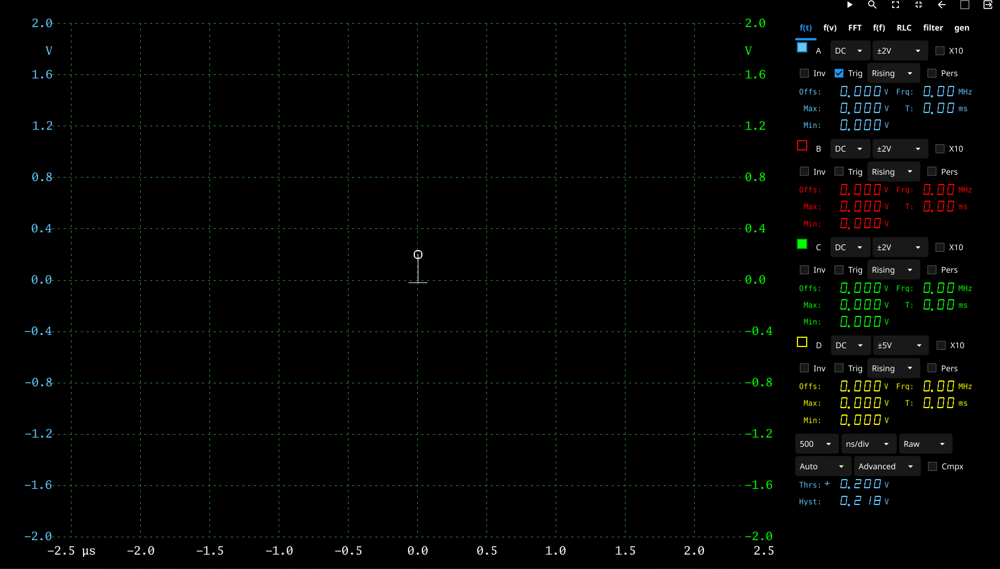
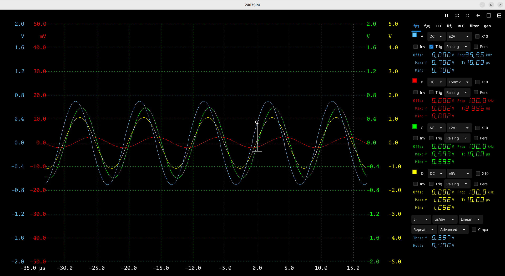

# fynescope

  

`fynescope` is a prototype graphical user interface and control Linux application for PicoScope 2000A Series PC Oscilloscopes, written in Go and based on the Fyne widget toolkit and the PicoScope 2000A series SDK.

## Documentation
For comprehensive details on features, installation, usage, and development, please read our **[Wiki Pages](github_wiki/Home.md)**!

In the Wiki, you will find detailed guides on:
- **[Getting Started](github_wiki/Getting-Started.md)**: Prerequisites, driver installations, build tags (`demo`, `sim`, `web`), and CLI flags.
- **[Features and Controls](github_wiki/Features-and-Controls.md)**: Visual indicators, mouse interactions, and media export controls.
- **[Demo Mode](github_wiki/Demo-Mode.md)**: How to explore the app without hardware using the built-in signal simulator.
- **[Generator Control](github_wiki/Generator-Control-(Demo).md)**: Deep dive into the simulated signal generators.
- **[Virtual Channels](github_wiki/Virtual-Channels.md)**: Creating custom math channels using arbitrary expressions.
- **[Trigger Modes](github_wiki/Trigger-Modes.md)**: Details on Simple, Advanced, Window, Interval, Pulse Width, and Complex triggering.
- **[Web Server & Voice Control](github_wiki/Web-Server-and-Voice-Control.md)**: Launching the MJPEG stream and controlling the scope hands-free using the Web Speech API.
- **[Testing & Debugging](github_wiki/Testing-and-Debugging.md)**: Automated UI fuzzing, logging, profiling, and unit tests.

  

## Limitations
`fynescope` is a focused, early-stage project with specific hardware dependencies and some missing advanced features compared to the official PicoScope 7 software (like protocol decoding, deep measure, and MSO support). 

For a complete breakdown of supported functionality versus limitations, please see the **[Limitations](github_wiki/Limitations.md)** wiki page.

## License
This project is licensed under the BSD 3-Clause License - see the [LICENSE](LICENSE) file for details. 
It also incorporates code and API structures from other open-source projects and hardware providers. Please see the [THIRD_PARTY_LICENSES](THIRD_PARTY_LICENSES) file for more information.

Copyright (c) 2026, László Fehér
