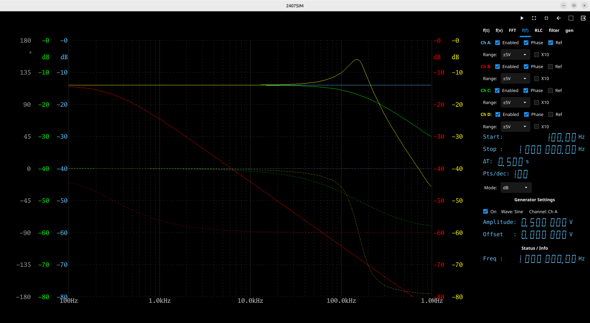
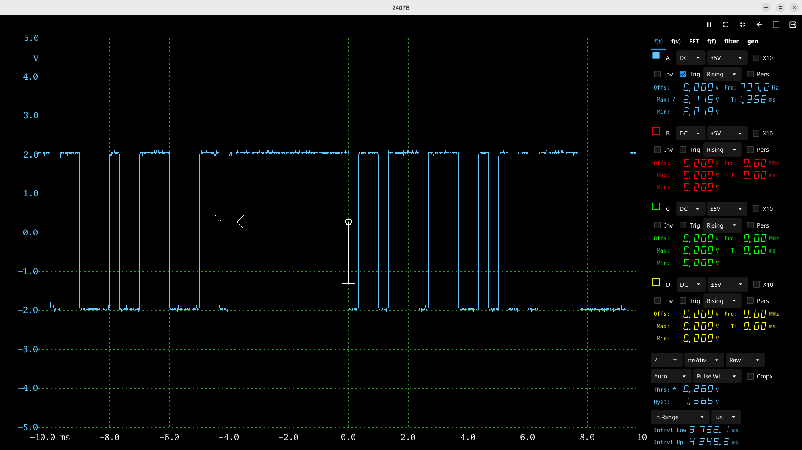

# fynescope


<p align="center">
  
</p>

`fynescope` is a cross-platform (Windows and Linux) graphical user interface and control application for PicoScope PC Oscilloscopes (focusing on the PicoScope 2000A and 2000A MSO Series). It is written in Go and built on the [Fyne](https://fyne.io/) widget toolkit and the PicoScope 2000A series SDK.

Whether connected to physical hardware or running offline in simulated demo mode, `fynescope` delivers a fast, responsive, and feature-rich oscilloscope experience.

---

## Key Features

- **Time-Domain Oscilloscope `f(t)`**: Multi-channel waveform capture, vertical and time divisions, linear and $\sin(x)/x$ interpolation, persistence, and an independent **Time Zoom** window for simultaneous wide-scale and detail inspection.
- **Mixed-Signal (MSO) Support**: Digital channel visualization (D0–D15) for MSO models (e.g. 2206B MSO), digital edge/pattern triggers, configurable logic thresholds (TTL, CMOS, ECL, or custom levels), and flexible channel stacking.
- **Comprehensive Triggering**: Simple Edge, Advanced Edge, Window, Interval, Pulse Width, Window Pulse Width, Runt, Dropout, Window Dropout, Logic, and Complex multi-channel triggers.
- **Protocol Decoding**: Built-in serial protocol decoding for **UART** and **SPI** directly from captured analog signals, complete with inline frame token overlays and error flags.
- **Spectrum Analyzer `FFT`**: Real-time frequency-domain analysis with linear/logarithmic frequency axes.
- **Frequency Response Analysis `f(f)` / Bode Plots**: Automated frequency sweeps with magnitude and phase response plots, auto-ranging support, and integration with the built-in AWG or external SCPI signal generators.
- **X-Y Mode `f(v)`**: Plot one channel against another to analyze phase relationships and Lissajous patterns.
- **Virtual / Math Channels**: Create real-time computed channels from physical inputs using arbitrary mathematical expressions (e.g. `chA + chB`, `chA * chB`, offsets, and scaling) via the [`expr`](https://github.com/antonmedv/expr) engine.
- **Digital & Analog Filters**: Real-time low-pass, high-pass, band-pass, and band-stop digital filters (FIR/IIR) with Zero-Phase (FiltFilt) capability, plus simulated RLC filters in demo mode.
- **Signal Generator / AWG**: Full control of built-in arbitrary waveform generators (sine, square, triangle, ramp, DC, noise, and sweeps).
- **Hardware-Free Demo Mode**: Built-in signal simulator generating multi-channel analog waveforms, digital patterns, sweeps, noise — explore the full UI without physical hardware.
- **Remote Web Server & Voice Control**: Live MJPEG streaming to any web browser with hands-free voice commands via the Web Speech API (`-webport`), protected by basic authentication.
- **Remote HTTPS REST API**: Query oscilloscope status and configure parameters programmatically over a secure REST API (`-apiport`, `-apiauth`).
- **Contextual Help**: Widget help on hover for quick on-screen guidance.

---

## Quick Start

### 1. Run in Demo Mode (No Hardware or PicoSDK Required)

You can run `fynescope` immediately in pure-Go demo mode without installing any PicoScope drivers or C toolchains:

```bash
# Run directly
go run -tags=demo . -demo

# Or build the binary
go build -tags=demo -o fynescope .
./fynescope -demo
```

### 2. Build with Real Hardware Support (Linux & Windows)

Requires Go 1.27, a C compiler (GCC via MSYS2 on Windows, or standard GCC on Linux), and the official PicoScope SDK (`libps2000a`).

For complete, step-by-step setup guides (including Windows toolchain setup, Linux packages, Raspberry Pi, and driver downloads), refer to [github-wiki/Getting-Started.md](github-wiki/Getting-Started.md) (also available on the [online Wiki](https://github.com/laszlofeher-v/fynescope/wiki/Getting-Started)):

```bash
# Clone the repository
git clone https://github.com/laszlofeher-v/fynescope.git
cd fynescope

# Download dependencies
go mod tidy

# Build native binary
go build -o fynescope .

# Launch application (auto-detects connected PicoScope)
./fynescope
```

### Build Tags

| Tag | Description |
|---|---|
| `demo` | Pure-Go build with built-in signal simulator (no PicoSDK or CGo required) |
| `sim` | Hardware simulator mocking the PicoScope C driver interface |
| `scpi` | Enables external SCPI signal generator control for Bode sweeps |
| `web` | Enables MJPEG web streaming and voice control server |

### Common CLI Options

```bash
./fynescope -demo                     # Launch in offline demo simulation mode
./fynescope -screensize=1920x1080     # UI scaling: 1920x1080, 1366x768, 1280x720, 1024x768
./fynescope -webport=8080             # Start live MJPEG stream & voice control web server
./fynescope -apiport=8443             # Start HTTPS remote control REST API server
./fynescope -gif                      # Enable UI button to export animated GIFs
./fynescope -ff-auto-range            # Enable auto-ranging during Bode frequency sweeps
./fynescope -loglevel=info            # Log verbosity: debug, info, warning, error
./fynescope -about                    # Display version, build date, and license information
```

---

## Screenshots

<p align="center">
  
</p>
<p align="center">
  
</p>

---

## Documentation

Comprehensive guides are available locally in the repository's [github-wiki/](github-wiki/) directory and published online on the **[GitHub Wiki](https://github.com/laszlofeher-v/fynescope/wiki)**:

- **[Getting Started](github-wiki/Getting-Started.md)** ([online](https://github.com/laszlofeher-v/fynescope/wiki/Getting-Started)): Detailed setup for Linux, Windows, and Raspberry Pi, driver installation, build tags, and CLI flags.
- **[Features and Controls](github-wiki/Features-and-Controls.md)** ([online](https://github.com/laszlofeher-v/fynescope/wiki/Features-and-Controls)): Visual indicators, mouse shortcuts, zooming, and media export controls.
- **[Demo Mode](github-wiki/Demo-Mode.md)** ([online](https://github.com/laszlofeher-v/fynescope/wiki/Demo-Mode)): Exploring the application without hardware using the built-in signal simulator.
- **[Generator Control](github-wiki/Generator-Control-(Demo).md)** ([online](https://github.com/laszlofeher-v/fynescope/wiki/Generator-Control-(Demo))): Built-in AWG and simulated signal generator controls.
- **[Virtual Channels](github-wiki/Virtual-Channels.md)** ([online](https://github.com/laszlofeher-v/fynescope/wiki/Virtual-Channels)): Custom math channels using arbitrary mathematical expressions.
- **[Trigger Modes](github-wiki/Trigger-Modes.md)** ([online](https://github.com/laszlofeher-v/fynescope/wiki/Trigger-Modes)): Simple, Advanced, Window, Interval, Pulse Width, Runt, Dropout, and Complex triggers.
- **[Protocol Decoding](github-wiki/Protocol-Decoding.md)** ([online](https://github.com/laszlofeher-v/fynescope/wiki/Protocol-Decoding)): UART and SPI serial bus decoding from analog waveforms.
- **[Resolution Increase](github-wiki/Resolution-Increase.md)** ([online](https://github.com/laszlofeher-v/fynescope/wiki/Resolution-Increase)): Software resolution enhancement techniques.
- **[Web Server & Voice Control](github-wiki/Web-Server-and-Voice-Control.md)** ([online](https://github.com/laszlofeher-v/fynescope/wiki/Web-Server-and-Voice-Control)): MJPEG browser streaming and hands-free voice control via Web Speech API.
- **[Testing & Debugging](github-wiki/Testing-and-Debugging.md)** ([online](https://github.com/laszlofeher-v/fynescope/wiki/Testing-and-Debugging)): Automated UI fuzzing, logging, profiling, and unit tests.
- **[Program Structure](github-wiki/Program-Structure.md)** ([online](https://github.com/laszlofeher-v/fynescope/wiki/Program-Structure)): Architecture breakdown of GUI, control, and driver abstraction layers.
- **[Limitations](github-wiki/Limitations.md)** ([online](https://github.com/laszlofeher-v/fynescope/wiki/Limitations)): Comparison with official PicoScope 7 software.

---

## Limitations

`fynescope` is a focused, open source project with specific hardware scope. While it supports advanced triggering, digital MSO channels, virtual math channels, and serial protocol decoding, certain features from the official PicoScope 7 software are currently not implemented (such as deep statistical measurements, mask limit testing, or additional protocols).

For a complete breakdown of supported functionality versus limitations, please see [github-wiki/Limitations.md](github-wiki/Limitations.md) (also on the [online Limitations page](https://github.com/laszlofeher-v/fynescope/wiki/Limitations)).

---

## License

This project is licensed under the BSD 3-Clause License - see the [LICENSE](LICENSE) file for details.  
It also incorporates code and API structures from other open-source projects and hardware providers. Please see the [THIRD_PARTY_LICENSES](THIRD_PARTY_LICENSES) file for more information.

Copyright (c) 2026, László Fehér
