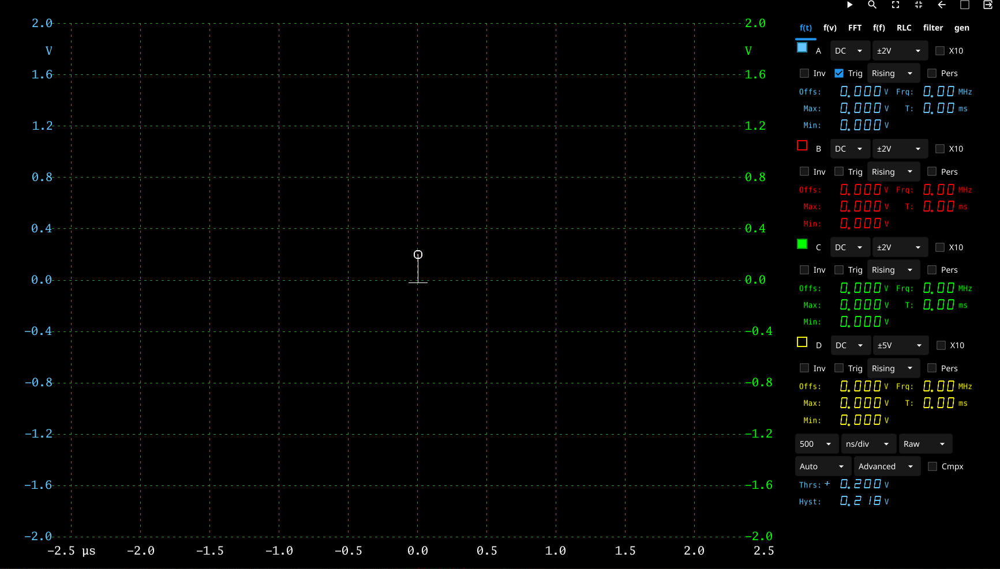
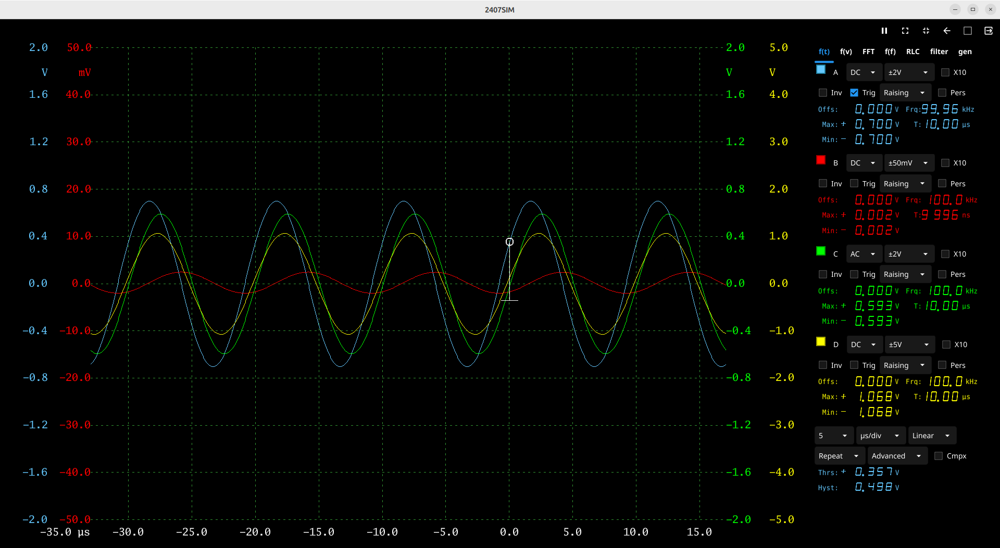
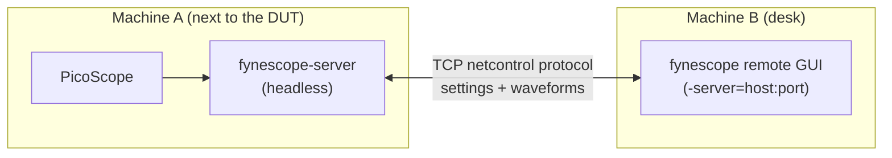
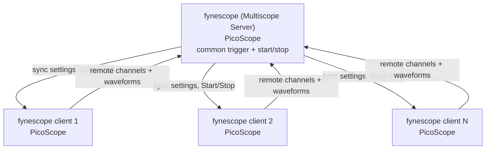
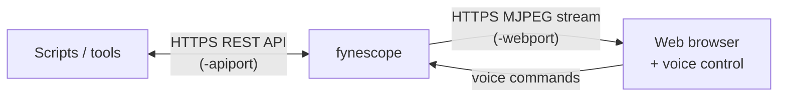
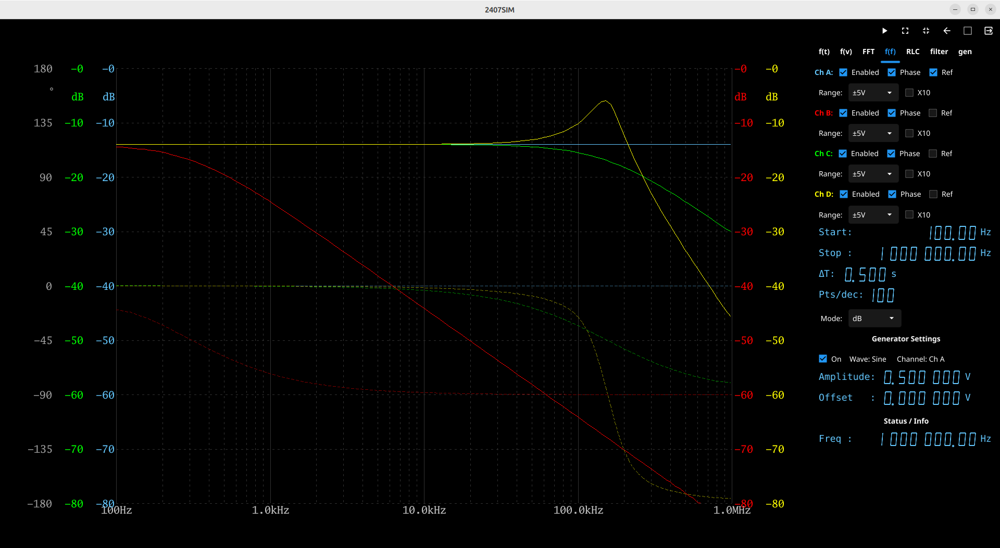
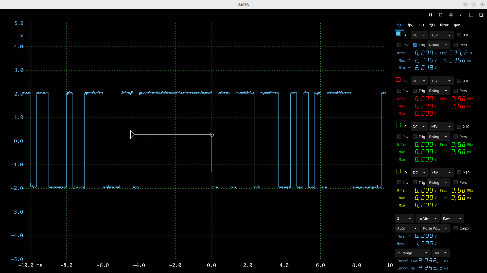

# fynescope

  

**Tested Platforms:** Linux x64, Raspberry Pi (Arm64), Windows 11 x64 – see [Platform Compatibility](#platform-compatibility).

`fynescope` is a graphical user interface and control application for PicoScope PC Oscilloscopes (focusing on the PicoScope 2000B and 2000B MSO Series). It is written in Go and built on the [Fyne](https://fyne.io/) widget toolkit and the PicoScope 2000A series SDK.

Whether connected to physical hardware or running offline in simulated demo mode, `fynescope` delivers a fast, responsive, and feature-rich oscilloscope experience.

---

## Key Features

- **Time-Domain Oscilloscope `f(t)`**: Multi-channel waveform capture, vertical and time divisions, linear and sin(x)/x interpolation, persistence, and an independent **Time Zoom** window for simultaneous wide-scale and detail inspection.
- **Mixed-Signal (MSO) Support**: Digital channel visualization (D0–D15) for MSO models (e.g. 2206B MSO), digital edge/pattern triggers, configurable logic thresholds (TTL, CMOS, ECL, or custom levels), and flexible channel stacking.
- **Comprehensive Triggering**: Simple Edge, Advanced Edge, Window, Interval, Pulse Width, Window Pulse Width, Runt, Dropout, Window Dropout, Logic, and Complex multi-channel triggers.
- **Protocol Decoding**: Built-in serial protocol decoding for **UART** and **SPI** on analog channels, complete with inline frame token overlays and error flags.
- **Spectrum Analyzer `FFT`**: Real-time frequency-domain analysis with linear/logarithmic frequency axes.
- **Frequency Response Analysis `f(f)` / Bode Plots**: Automated frequency sweeps with magnitude and phase response plots and integration with the built-in AWG or external SCPI signal generators.
- **X-Y Mode `f(v)`**: Plot one channel against another to analyze phase relationships and Lissajous patterns.
- **Virtual / Math Channels**: Create real-time computed channels from physical inputs using arbitrary mathematical expressions (e.g. `chA + chB`, `chA * chB`, offsets, and scaling) via the [`expr`](https://github.com/antonmedv/expr) engine.
- **Digital & Analog Filters**: Real-time low-pass, high-pass, band-pass, and band-stop digital filters (FIR/IIR) with Zero-Phase (FiltFilt) capability, plus simulated RLC filters in demo mode.
- **Correlation Calculation**: Real-time Pearson scalar correlation and Cross-Correlation function calculation between channels.
- **Signal Generator / AWG**: Full control of built-in arbitrary waveform generators (sine, square, triangle, ramp, DC, noise, and sweeps).
- **SCPI Support**: Control external SCPI signal generators over USB for automated testing and Bode plot generation.
- **Hardware-Free Demo Mode**: Built-in signal simulator generating multi-channel analog waveforms, digital patterns, sweeps, noise — explore the full UI without physical hardware.
- **Remote Web Server & Voice Control**: Live MJPEG streaming to any web browser with hands-free voice commands via the Web Speech API (`-webport`), protected by basic authentication. Do not expect too much from the voice control, it is just a demo feature. 
- **Remote HTTPS REST API**: Query oscilloscope status and configure parameters programmatically over a secure REST API (`-apiport`, `-apiauth`).
- **Remote GUI**: Run the scope hardware on one machine (e.g. a Raspberry Pi next to the device under test) using the headless `fynescope-server`, and operate the full oscilloscope UI from another machine with the GUI-only remote client (`-server=host:port`).
- **Multiscope**: Connect several fynescope instances over TCP in Server/Client mode. Remote channels are announced and streamed to the server, with a common trigger source and synchronized start/stop of acquisition across all instruments (`-multi`). E.g. Two four-channel scopes can work as a seven-channel scope because the two trigger channels are physically connected to the same source.

### Networked Features

**Remote GUI** – hardware on the server, UI on the client:

```mermaid
flowchart LR
    subgraph Server["Machine A (next to the DUT)"]
        HW["PicoScope"] --> SRV["fynescope-server<br/>(headless)"]
    end
    subgraph Client["Machine B (desk)"]
        GUI["fynescope remote GUI<br/>(-server=host:port)"]
    end
    SRV <-->|"TCP netcontrol protocol<br/>settings + waveforms"| GUI
```

**Multiscope** – several scopes, one view, common trigger:

```mermaid
flowchart TB
    S["fynescope (Multiscope Server)<br/>PicoScope<br/>common trigger + start/stop"]
    C1["fynescope client 1<br/>PicoScope"]
    C2["fynescope client 2<br/>PicoScope"]
    C3["fynescope client N<br/>PicoScope"]
    S -->|"sync settings, Start/Stop"| C1
    S -->|"sync settings, Start/Stop"| C2
    S -->|"sync settings, Start/Stop"| C3
    C1 -->|"remote channels + waveforms"| S
    C2 -->|"remote channels + waveforms"| S
    C3 -->|"remote channels + waveforms"| S
```

**Web & REST access** – browser and scripts:

```mermaid
flowchart LR
    F["fynescope"] -->|"HTTPS MJPEG stream<br/>(-webport)"| B["Web browser<br/>+ voice control"]
    B -->|"voice commands"| F
    A["Scripts / tools"] <-->|"HTTPS REST API<br/>(-apiport)"| F
```

---

## Platform Compatibility

### Tested platforms

| Platform | Architecture | Status |
|---|---|---|
| Ubuntu 24.04 (desktop) | x86-64 | Tested |
| Raspberry Pi OS (Raspberry Pi 4 and newer) | ARM64 | Tested |
| Windows 11 | x86-64 | Tested |

### Other possible platforms

fynescope depends on Go, the Fyne toolkit and the PicoScope SDK. It should be portable to any platform where all three are available; these have **not** been tested:

- **macOS (Intel and Apple Silicon)** – Go and Fyne are fully supported, and Pico Technology provides PicoScope drivers for macOS.
- **Windows on ARM64** and **Linux on other architectures (e.g. ARM32, RISC-V)** – supported by Go and Fyne; availability depends on a PicoScope SDK build for the architecture. 32 bit architecture needs major API porting effort.

- **Demo mode** (`-tags=demo`) needs only Go and Fyne, so it can run anywhere Fyne runs, without the PicoScope SDK.
- **Remote GUI client** needs only Go and Fyne, so a machine without PicoScope drivers can still display a scope connected elsewhere on the network.

---

## Quick Start

For complete, step-by-step setup guides (including Windows toolchain setup, Linux packages, Raspberry Pi, and driver downloads), please refer to the **[Getting Started Wiki](https://github.com/laszlofeher-v/fynescope/wiki/Getting-Started)**.

---

## Screenshots

  

  

---

## Documentation

Comprehensive guides are published online on the **[GitHub Wiki](https://github.com/laszlofeher-v/fynescope/wiki)**:

- **[Getting Started](https://github.com/laszlofeher-v/fynescope/wiki/Getting-Started)**: Detailed setup for Linux, Windows, and Raspberry Pi, driver installation, build tags, and CLI flags.
- **[Features and Controls](https://github.com/laszlofeher-v/fynescope/wiki/Features-and-Controls)**: Visual indicators, mouse shortcuts, zooming, and media export controls.
- **[Demo Mode](https://github.com/laszlofeher-v/fynescope/wiki/Demo-Mode)**: Exploring the application without hardware using the built-in signal simulator.
- **[Generator Control](https://github.com/laszlofeher-v/fynescope/wiki/Generator-Control-(Demo))**: Built-in AWG and simulated signal generator controls.
- **[Virtual Channels](https://github.com/laszlofeher-v/fynescope/wiki/Virtual-Channels)**: Custom math channels using arbitrary mathematical expressions.
- **[Trigger Modes](https://github.com/laszlofeher-v/fynescope/wiki/Trigger-Modes)**: Simple, Advanced, Window, Interval, Pulse Width, Runt, Dropout, and Complex triggers.
- **[Protocol Decoding](https://github.com/laszlofeher-v/fynescope/wiki/Protocol-Decoding)**: UART and SPI serial bus decoding from analog waveforms.
- **[Resolution Increase](https://github.com/laszlofeher-v/fynescope/wiki/Resolution-Increase)**: Software resolution enhancement techniques.
- **[Web Server & Voice Control](https://github.com/laszlofeher-v/fynescope/wiki/Web-Server-and-Voice-Control)**: MJPEG browser streaming and hands-free voice control via Web Speech API.
- **[Testing & Debugging](https://github.com/laszlofeher-v/fynescope/wiki/Testing-and-Debugging)**: Automated UI fuzzing, logging, profiling, and unit tests.
- **[Program Structure](https://github.com/laszlofeher-v/fynescope/wiki/Program-Structure)**: Architecture breakdown of GUI, control, and driver abstraction layers.
- **[Limitations](https://github.com/laszlofeher-v/fynescope/wiki/Limitations)**: Comparison with official PicoScope 7 software.

---

## Development Tools

`fynescope` was developed with the following tools:

- **[LiteIDE](https://github.com/visualfc/liteide)** — primary Go IDE used throughout the project.
- **[Antigravity](https://antigravity.dev)** — AI-powered coding assistant (by Google DeepMind) used for pair programming, refactoring, and documentation.
- **AI assistance** — various AI language models were used to help design algorithms, coding, code review, and writing tests and documentation.

---

## License

This project is licensed under the BSD 3-Clause License - see the [LICENSE](LICENSE) file for details.  
It also incorporates code and API structures from other open-source projects and hardware providers. Please see the [THIRD_PARTY_LICENSES](THIRD_PARTY_LICENSES) file for more information.

Copyright (c) 2026, László Fehér
